<div align="center">
<picture>
  <source media="(prefers-color-scheme: dark)" srcset="docs/brand/repo-banner-dark.svg">
  
</picture>
</div>

**openLN** is an open-source, non-custodial Lightning commerce platform. The wallet is the core; cards, POS, POSBOX, reports and shop are compile-time plugins around it. It runs on your own box, holds no keys and no funds, and moves the money from the customer's wallet straight into the merchant's. The same code runs in production at [openln.com](https://openln.com).

## How a payment runs

1. A customer taps a Bolt Card or scans the invoice.
2. The core resolves the merchant's wallet over NWC and creates the invoice.
3. The payment routes on Lightning and settles in the merchant's own wallet.
4. openLN keeps the receipts, the rules and the reports. It never holds the money.

## What is in the box

- **`core/`**: wallet connections over NWC, invoice lifecycle, settlement, the money path
- **`plugins/`**: cards, POS, POSBOX, reports, shop, partner: one typed contract, imported at startup
- **`card-writer/`**: write and wipe NTAG424 Bolt Cards from the browser, over a local NFC bridge
- **`firmware/`**: RIC (ESP32) terminal firmware and its release artifacts
- **`artifacts/`**: the built web surfaces (merchant app, card marketplace) and runtime env
- **`migrations/`**: Postgres schema, applied idempotently
- **`scripts/`**, **`tests/`**: ship and deploy tooling, unit and integration suites
- **`docs/`**: deploy notes, plugin API, wallet compatibility

## The plugin contract

Plugins are compile-time TypeScript modules imported at startup; the core never evaluates plugin code supplied at runtime. The contract is `OpenLnPlugin` in [`core/plugins/api.ts`](core/plugins/api.ts), with notes in [`docs/plugin-api.md`](docs/plugin-api.md). Payment behavior is not an extension point: settlement stays in core, with an append-only flight recorder.

## Quick start

```sh
pnpm install
pnpm typecheck && pnpm build

export DATABASE_URL=postgresql://127.0.0.1/openln
export SESSION_SECRET=local-dev-secret
for f in migrations/*.sql; do psql "$DATABASE_URL" -f "$f"; done   # idempotent

node dist/core/server.js          # PORT defaults to 3001
curl http://127.0.0.1:3001/health
```

The unit suite runs against `postgresql://127.0.0.1/openln_test`: `pnpm test`. Deployment notes live in [`docs/deploy.md`](docs/deploy.md).

> Your keys stay yours. Your server, your rules. Read the source. Verify, don't trust.

---

<div align="center">
<p><a href="https://openln.com">openln.com</a> · <a href="https://cards.openln.com">card marketplace</a> · <a href="https://github.com/openlnhq">GitHub org</a> · <a href="https://github.com/openlnhq/openln/releases">releases</a> · <a href="https://x.com/Open_LN">@Open_LN</a></p>
<p><sub>AGPL-3.0. Built locally. Serve globally.</sub></p>
</div>
